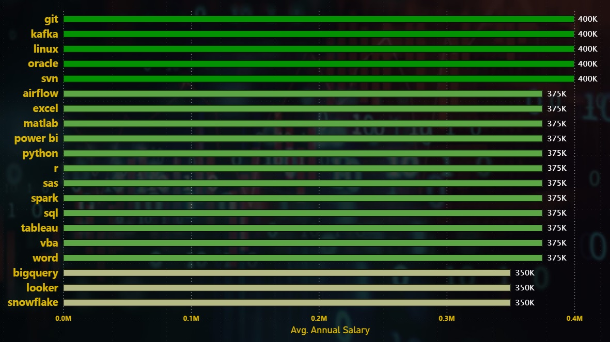

# 📊 Data Job Analysis with SQL - Introduction

This project explores the job market through the lens of SQL, diving into real-world data to extract trends, correlations, and high-impact insights in the Data industry (2023).

It focuses on:
- 🔍 **Different data-related job roles** (Analyst, Scientist, Engineer, etc.)
- 💼 **In-demand skills** across the tech landscape
- 💰 **Where high demand meets high pay** - Identifying the sweet spots for upskilling

Whether you're a hiring manager, aspiring analyst, or someone exploring how data shapes modern job markets, this project brings you the *answers backed by SQL logic*. No fluff, just facts.

Want to see SQL queries? Check them out here: [project_sql folder](/project_sql/)


#  🚀 Project Overview

<font size="4">🎯 Purpose</font>

- **Motivation:** Understand job market dynamics using real-world data, including job listings, salaries, companies, and skill demands.
- **Objective:** Showcase intermediate SQL proficiency through a complete data analysis pipeline, ingestion, cleaning, transformation, and deep-dive querying.
- **Audience:** Designed for hiring managers, recruiters, and data professionals who want to assess SQL capability *and* business insight delivery.

<font size="4">❓ The key questions explored here:</font>
<font size="3">
1. What are the **Top 10 highest-paying jobs** for a Data Analyst?
2. What are the **skills required** for these top-paying roles?
3. What are the **most in-demand skills** for a Data Analyst?
4. Which skills are most strongly correlated with **higher salaries**?
5. What are the **most optimal skills to learn** (i.e. skills that are both **in high demand** and **high paying**)?
</font>

These questions aim to guide both career decisions and skill prioritization for aspiring data analysts.

# 📁 Repository Structure

``` text
SQL_Project_Data_lob_Analysis/
├── project_sql/
│   ├── 1_top_paying_jobs.sql
│   ├── 2_top_paying_job_skills.sql
│   ├── 3_top_demanded_skills.sql
│   ├── 4_top_paying_skills.sql
│   └── 5_optimal_skills_and_salaries.sql
├── query_results/
│   ├── 1_top_paying_jobs.csv
│   ├── 2_top_paying_job_skills.csv
│   ├── 3_top_demanded_skills.csv  # Fixed space in filename
│   ├── 4_top_paying_skills.csv
│   └── 5_optimal_skills_and_salaries.csv
├── result_visualization/
│   └── SQL_Project_Data_lob_Analysis_Dashboard.pbix
├── sql_load/
│   ├── 1_create_database.sql
│   ├── 2_create_tables.sql
│   └── 3_modify_tables.sql  # Fixed dot to underscore for consistency
├── .gitignore
├── LICENSE.md
└── README.md
```

# 🛠️ Tools Used

To dive deep into job market data and deliver meaningful insights, I leveraged a combination of powerful tools:

- **🗃️ SQL** – The core engine behind all data wrangling, exploration, and insight generation.
- **🐘 PostgreSQL** – Used as the relational database to execute structured queries efficiently.
- **🧑‍💻 Visual Studio Code** – For writing, organizing, and version-controlling all SQL scripts and project files.
- **🔧 Git & GitHub** – Version control and portfolio hosting to track progress and share the project publicly.
- **📊 Power BI** – For building a visual layer that translates SQL results into compelling dashboard.

These tools together simulate a real-world analytics environment, combining backend querying with frontend storytelling.

# 🧠 Data Cleaning & Processing

A structured and clean dataset is the foundation of any solid analysis. Here's how data preparation was handled:

- 🧩 **Consolidated multiple datasets** into a relational structure using SQL imports and basic ETL practices.
- 🧼 **Handled missing values** across job titles, salaries, and skill tags to avoid skewed results.
- 💵 **Normalized salary fields** into a consistent annual format to ensure accurate comparisons.
- 🗓️ **Standardized date formats** and regional codes for uniform filtering and grouping.
- 🏗️ **Created staging layers** using views and temporary tables to organize and modularize complex queries.

The result? Clean, query-ready data that enables accurate, efficient analysis.

# 📌 Techniques & Core Analysis

This project showcases a variety of intermediate-to-advanced SQL techniques to extract actionable insights from raw data:

- 🔗 **Relational Joins** – Combined datasets across job postings & skills tables for unified analysis.
- 🧱 **CTEs (Common Table Expressions)** – Modularized complex queries for better readability and reusability.
- 🧠 **Subqueries** – Used for filtering, ranking, and creating temporary aggregates on the fly.
- 📊 **Aggregation Functions** – Leveraged `COUNT()`, `AVG()`, `ORDER BY`  and `GROUP BY` to rank attributes.
- 💾 **Reusable Views/Tables** – Created structured outputs to support seamless handoff to visualization tools like Power BI.

These techniques mirror real-world analytics workflows and demonstrate readiness for SQL-heavy analyst roles.

[<font size="5">**If You want to interact with the full Power BI Dashborad, Just Click here**</font>](https://app.powerbi.com/view?r=eyJrIjoiZmEyODRlYTYtZDM2My00MTJkLWIxODItOWRlZjYxYjc5N2VhIiwidCI6ImM0ZGRhYWFjLTQ4OWItNGQ1Zi1hMzVjLWFhODVlNmVkZjhkOCJ9)

<font size="4">1. 💸 Top Paying Data Analyst Jobs</font>

To uncover the highest-paying data analyst roles, I filtered positions by average annual salary and job title. This query targets roles explicitly labeled as "Data Analyst" and highlights lucrative opportunities in the market.

```sql
SELECT
    jp.job_id,
    cd.name AS company_name,
    jp.job_title,
    jp.job_location,
    jp.job_schedule_type,
    ROUND(jp.salary_year_avg, 2) AS annual_avg_salary,
    jp.job_posted_date
FROM
    job_postings_fact as jp
LEFT JOIN
    company_dim AS cd ON jp.company_id = cd.company_id
WHERE
    jp.job_title_short LIKE 'Data Analyst'
    AND jp.salary_year_avg IS NOT NULL
ORDER BY
    annual_avg_salary DESC
LIMIT 15;
```

*Annual Salary by Job Title*

<font size="3">🔍 Insights</font>
- **💰 Wide Salary Range:** Top-paying analyst roles span from $240K to $650K, showing massive upside depending on company and seniority.
- **🧑‍💼 Title Variety:** Although filtered by “Data Analyst,” roles range from junior analysts to Directors of Analytics, highlighting the broad usage of the title across experience levels.

This analysis helps candidates identify where the money is, and which roles to target when negotiating compensation or planning upskilling.ctor of Analytics, reflecting diverse specializations in the field.

## 2. 🧠 Skills Related to Top Paying Data Analyst Jobs
To understand which skills are most valued in **top-paying data analyst roles**, I joined the `job_postings_fact` table with `skills_job_dim` and `skills_dim`. The goal is to surface **specific tools, coding languages, and platforms** that consistently appear in high-compensation remote analyst roles.


```sql
WITH top_paying_jobs AS (
    SELECT
        jp.job_id,
        cd.name AS company_name,
        jp.job_title,
        jp.salary_year_avg AS annual_salary
    FROM
        job_postings_fact AS jp
    LEFT JOIN
        company_dim AS cd ON jp.company_id = cd.company_id
    WHERE
        jp.job_title_short = 'Data Analyst'
        AND jp.salary_year_avg IS NOT NULL
    ORDER BY
        annual_salary DESC
    LIMIT 20
)

SELECT
    tp.*,
    sd.skills AS skill_name
FROM
    top_paying_jobs AS tp
INNER JOIN
    skills_job_dim AS sjd ON tp.job_id = sjd.job_id
INNER JOIN
    skills_dim AS sd ON sjd.skill_id = sd.skill_id
ORDER BY
    annual_salary DESC;
```


*Top Skills Related to High Paying Data Analyst Related Jobs*


<font size="3">🔍 Insights</font>
- **Git, Kafka, Linux, Oracle, and SVN** lead with the highest average annual salary, indicating strong demand in version control, data streaming, and database management.
- **Airflow, Excel, Matlab, Power BI, Python, R, SAS, Spark, SQL, Tableau, VBA, and Word** follow with a consistent salary, showcasing a broad range of valuable skills across coding, data analysis, and business intelligence.
- **BigQuery, Looker, and Snowflake** are at the lower end, suggesting niche but still significant roles in big data and visualization.
- The top-tier skills (400K) are concentrated in DevOps and traditional database categories, while the 375K range spans multiple domains including **machine learning, statistics, and office tools**.
- The salary distribution shows a clear tiering, with a significant drop from 400K to 350K, highlighting the premium on certain specialized tools.

If someone is looking to prioritize skill-building, better to start with SQL and Python, then stack dashboarding, statistical, and cloud skills for maximum payoff.

## 3. 📈 In-Demand Skills for Data Analytics
This query identifies the **most frequently requested skills** in data analyst job postings. It helps highlight where the industry is placing the most value and critical insight for anyone planning their upskilling path.


```sql
SELECT
    jp.job_title_short,
    sd.skills AS skill_name,
    COUNT(sjd.job_id) AS demand_count
FROM
    job_postings_fact AS jp
INNER JOIN
    skills_job_dim AS sjd ON jp.job_id = sjd.job_id
INNER JOIN
    skills_dim AS sd ON sjd.skill_id = sd.skill_id
WHERE
    jp.job_title_short = 'Data Analyst'
GROUP BY
    jp.job_title_short,
    skill_name
ORDER BY
    demand_count DESC
LIMIT 20;
```

*Count of In-Demand Skills for Data Analytics*

<font size="3">🔍 Core Foundational Skills</font>
- **SQL & Excel:** Still the bedrock of data analysis. Whether it’s structured querying or spreadsheet work, these remain non-negotiable in almost every posting.
- **Python:** Increasingly essential, used for automation, analysis, and light machine learning tasks.
- **Tableau & Power BI:** Must-know tools for data storytelling, dashboard building, and executive reporting.

If you're building a career in data analytics, mastering SQL + Excel + Python + one dashboard tool (Tableau/Power BI) sets you up for ~80% of job listings in the market.

## 4. 💸 Highest Paying Skills for Data Analysts

Analyzing salaries by skill reveals where the real money’s at.

```sql
SELECT
    sd.skills AS skill_name,
    ROUND(AVG(jp.salary_year_avg), 2) AS avg_salary
FROM
    job_postings_fact AS jp
INNER JOIN
    skills_job_dim AS sjd ON jp.job_id = sjd.job_id
INNER JOIN
    skills_dim AS sd ON sjd.skill_id = sd.skill_id
WHERE
    jp.job_title_short = 'Data Analyst'
    AND jp.salary_year_avg IS NOT NULL
GROUP BY
    skill_name
ORDER BY
    avg_salary DESC
LIMIT 25;
```
\
*Highest Paying Skills for Data Analysts*

<font size="3">🔍 Insights</font>
- **SVN** stands out as a highly valued skill, leading the list.
- **Solidity and Couchbase** emerge as notable skills with significant demand.
- **Golang, mxnet, and dplyr** show strong presence among technical skills.
- **Terraform and twilio** indicate growing importance in infrastructure and communication tools.
- **Keras, pytorch, and tensorflow** highlight the prominence of machine learning frameworks.

## 5. 🎯 Most Optimal Skill-Salary Combinations
By combining demand + salary data, we pinpointed the sweet spot: skills that are both in high demand and lead to higher paychecks

```sql
SELECT
    sd.skill_id,
    sd.skills AS skill_name,
    COUNT(sjd.job_id) AS demand_count,
    ROUND(AVG(jp.salary_year_avg), 2) AS annual_average_salary
FROM
    job_postings_fact AS jp
INNER JOIN
    skills_job_dim AS sjd ON jp.job_id = sjd.job_id
INNER JOIN
    skills_dim AS sd ON sjd.skill_id = sd.skill_id
WHERE
    jp.job_title_short = 'Data Analyst'
    AND jp.salary_year_avg IS NOT NULL
GROUP BY
    sd.skill_id,
    skill_name
HAVING
    COUNT(sjd.job_id) > 10
ORDER BY
    annual_average_salary DESC,
    demand_count DESC
LIMIT 20;
```

*Most Optimal Skill-Salary Combinations*

<font size="3">🔍 Insights</font>
- **MongoDB** leads with the highest average salary and demand, excelling in database management.
- **Kafka** and **PyTorch** show strong presence in data streaming and machine learning.
- **TensorFlow** and **Cassandra** indicate solid demand in machine learning and database categories.
- **Airflow** and **Spark highlight** growing demand in DevOps and big data processing.
- **Snowflake** and **Git** stand out with high demand in cloud data platforms and coding/version control.

## 💡 Key Takeaways
- Learn cloud + big data tools to jump pay brackets.
- Python is a must, not optional.
- Niche viz tools like Looker = strategic salary boost.
- Old-school DBs still holding ground in hybrid stacks.

# 🧠 Learning Outcomes - SQL Skills Adventure

<font size="4">🚀 Advanced SQL Mastery</font>
- Complex Queries:
    - Multi-table JOINs
    - CTEs using WITH clauses
    - Efficient subquery handling

- Aggregation & Summarization:
    - Proficient with GROUP BY, COUNT(), AVG()
    - Used aggregation to answer real-world data problems

- Analytical Thinking
    - Translated business problems into structured queries
    - Built reusable views/tables for deeper insights
    - Extracted KPIs & trends for strategic decisions

# 🛠️ Setup & Run Instructions

1. Clone repo: `git clone https://github.com/ThilinaPerera-DataAnalytics/SQL_Project_Data_Job_Analysis.git`
2. Load cleaned data into a SQL database.
3. Run `sh load_and_clean.sh` (or manual SQL scripts).
4. Execute main queries: `psql -f sql/<project_name>.sql`
5. Review outputs under `outputs/result_snapshots/` (.csv or .png snapshots).


# 📬 Credits & Contact
📁 **Data Source:**  
All datasets were sourced from [Luke Barousse's SQL Web space](https://sqliteviz.com/app/#/workspace?hide_schema=1), a publicly available sandbox environment for SQL learning and exploration.

Feel free to reach out if you’d like feedback, collab, or just want to geek out over SQL stuff.

